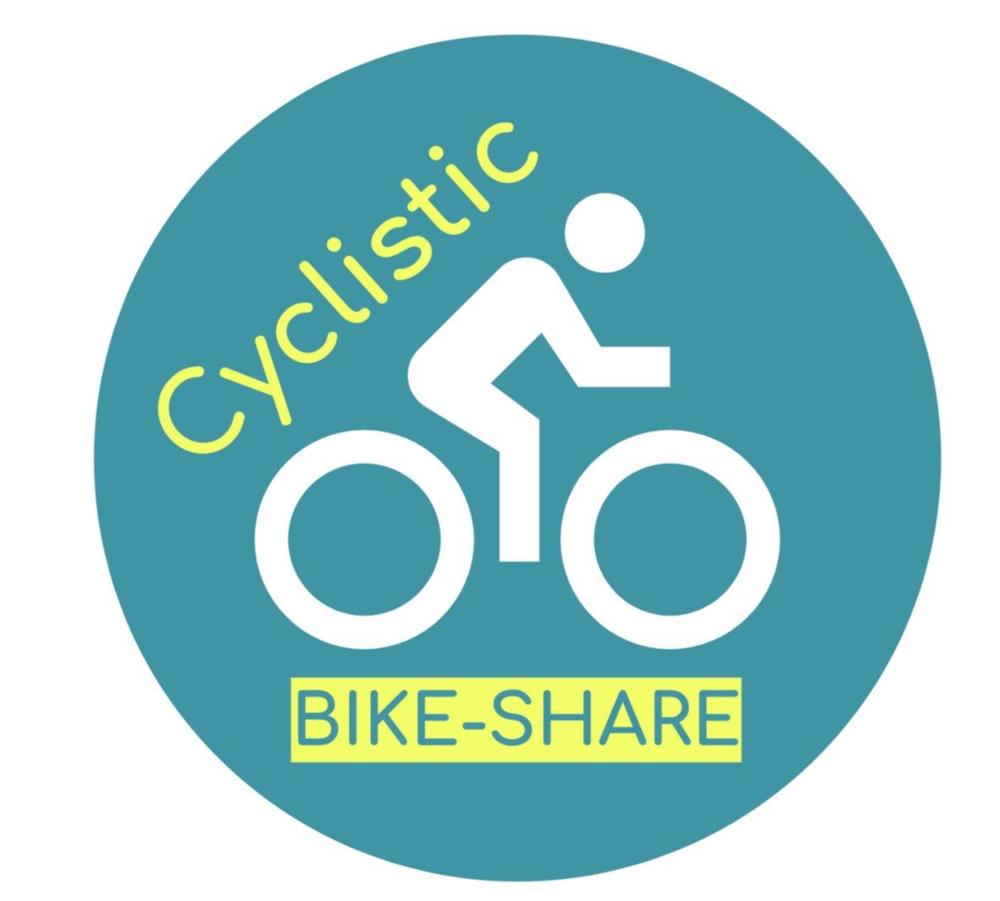
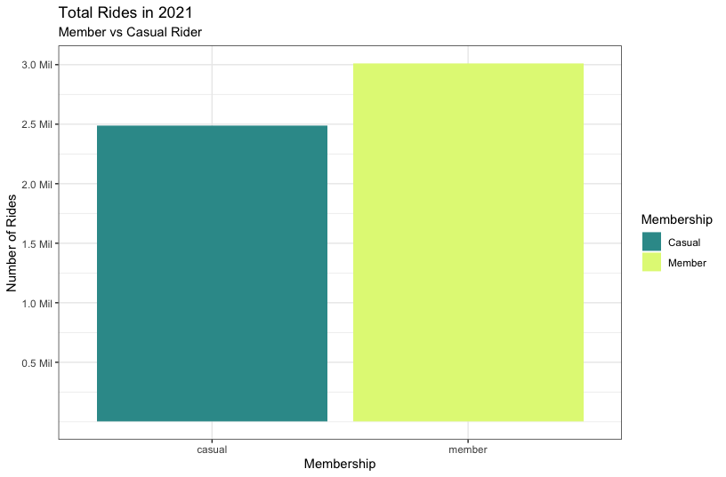
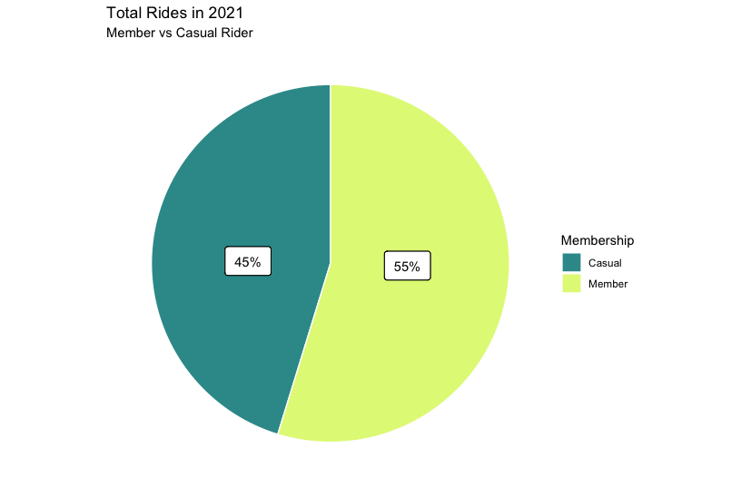
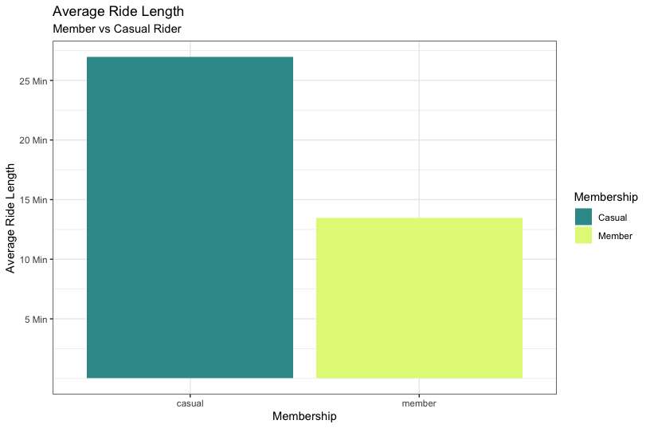
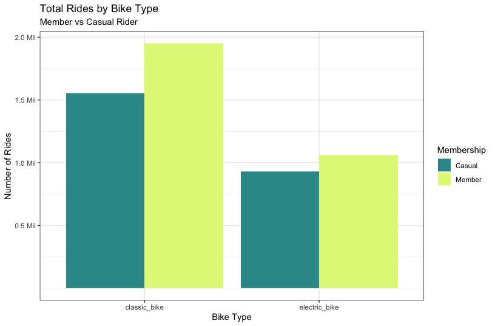
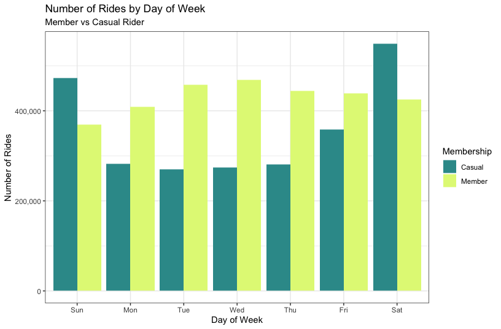
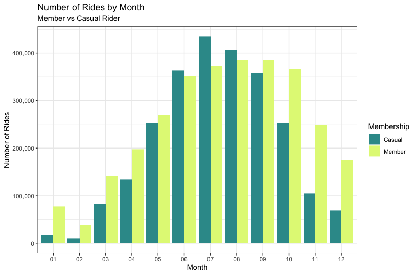
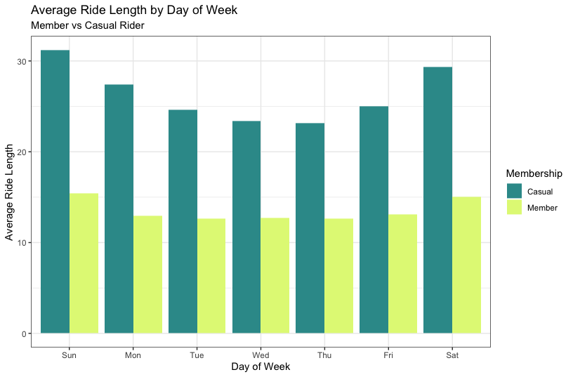
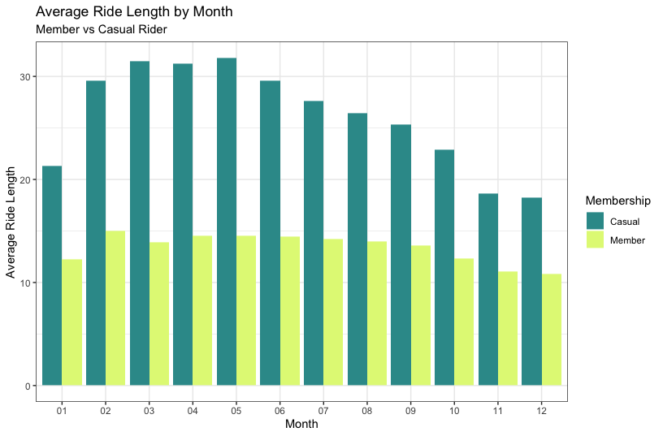
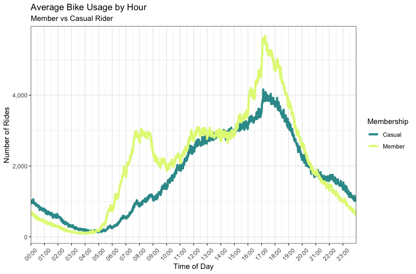

Cyclistic Case Study
================
Schon Huntington
05-07-2022

<center>

</center>

## Cyclistic

Cyclistic is a bike-share program in Chicago that features more than
5,800 bicycles and 600 docking stations around the city. Most of the
customers use Cyclistic for leisure, but about 30% use the service to
commute to and from work each day. Cyclistic offers three pricing plans
for it’s users: single-ride passes, full-day passes, and annual
memberships. Customers who purchase single-ride or full-day passes are
referred to as casual riders. Customers who purchase annual memberships
are Cyclistic members.

The finance analysts at Cyclistic have concluded that annual members are
much more profitable than casual riders. Although the pricing
flexibility helps Cyclistic attract more customers, the company believes
that maximizing the number of annual members will be key to future
growth.  
 

## Objective

Understand how casual riders and annual members use Cyclistic bikes
differently to help the Marketing Team design a new marketing strategy
to convert casual riders into annual members.  
 

## Data

For this project I used the public data provided by the bike-share
company, Divvy. The data was made available through a data licensing
agreement, which can be accessed
[here](https://ride.divvybikes.com/data-license-agreement).

The following packages were loaded in RStudio to work with the data:

``` r
library(tidyverse)
library(ggplot2)
library(lubridate)
library(dplyr)
library(readxl)
library(readr)
```

To start, I downloaded the twelve months of trip data for 2021 as CSV
files and converted them to XLSX files. From there, I imported the
twelve CSV files to RStudio and combined them into one data table that
included over 5.5 million rows of data representing each individual trip
taken in 2021.  
 

Code to import XLSX files and format columns:

``` r
divvy_01_2021 <- read_excel("Documents/Case Study/01-2021-divvy-tripdata.xlsx", 
   col_types = c("text", "text", "date", "date", "text", "numeric", "text", 
                 "text", "text", "text", "text", "numeric", "numeric", 
                 "numeric", "numeric", "text"))
divvy_02_2021 <- read_excel("Documents/Case Study/02-2021-divvy-tripdata.xlsx", 
   col_types = c("text", "text", "date", "date", "text", "numeric", "text", 
                 "text", "text", "text", "text", "numeric", "numeric", 
                 "numeric", "numeric", "text"))
divvy_03_2021 <- read_excel("Documents/Case Study/03-2021-divvy-tripdata.xlsx", 
   col_types = c("text", "text", "date", "date", "text", "numeric", "text", 
                 "text", "text", "text", "text", "numeric", "numeric", 
                 "numeric", "numeric", "text"))
divvy_04_2021 <- read_excel("Documents/Case Study/04-2021-divvy-tripdata.xlsx", 
   col_types = c("text", "text", "date", "date", "text", "numeric", "text", 
                 "text", "text", "text", "text", "numeric", "numeric", 
                 "numeric", "numeric", "text"))
divvy_05_2021 <- read_excel("Documents/Case Study/05-2021-divvy-tripdata.xlsx", 
   col_types = c("text", "text", "date", "date", "text", "numeric", "text", 
                 "text", "text", "text", "text", "numeric", "numeric", 
                 "numeric", "numeric", "text"))
divvy_06_2021 <- read_excel("Documents/Case Study/06-2021-divvy-tripdata.xlsx", 
   col_types = c("text", "text", "date", "date", "text", "numeric", "text", 
                 "text", "text", "text", "text", "numeric", "numeric", 
                 "numeric", "numeric", "text"))
divvy_07_2021 <- read_excel("Documents/Case Study/07-2021-divvy-tripdata.xlsx", 
   col_types = c("text", "text", "date", "date", "text", "numeric", "text", 
                 "text", "text", "text", "text", "numeric", "numeric", 
                 "numeric", "numeric", "text"))
divvy_08_2021 <- read_excel("Documents/Case Study/08-2021-divvy-tripdata.xlsx", 
   col_types = c("text", "text", "date", "date", "text", "numeric", "text", 
                 "text", "text", "text", "text", "numeric", "numeric", 
                 "numeric", "numeric", "text"))
divvy_09_2021 <- read_excel("Documents/Case Study/09-2021-divvy-tripdata.xlsx", 
   col_types = c("text", "text", "date", "date", "text", "numeric", "text", 
                 "text", "text", "text", "text", "numeric", "numeric", 
                 "numeric", "numeric", "text"))
divvy_10_2021 <- read_excel("Documents/Case Study/10-2021-divvy-tripdata.xlsx", 
   col_types = c("text", "text", "date", "date", "text", "numeric", "text", 
                 "text", "text", "text", "text", "numeric", "numeric", 
                 "numeric", "numeric", "text"))
divvy_11_2021 <- read_excel("Documents/Case Study/11-2021-divvy-tripdata.xlsx", 
   col_types = c("text", "text", "date", "date", "text", "numeric", "text", 
                 "text", "text", "text", "text", "numeric", "numeric", 
                 "numeric", "numeric", "text"))
divvy_12_2021 <- read_excel("Documents/Case Study/12-2021-divvy-tripdata.xlsx", 
   col_types = c("text", "text", "date", "date", "text", "numeric", "text", 
                 "text", "text", "text", "text", "numeric", "numeric", 
                 "numeric", "numeric", "text"))
```

  
 

## Data Cleaning

The bulk of my data cleaning process was completed using Excel. This was
primarily because of my comfort with the program, but there were a
couple of downsides to using Excel.

The biggest negative in using Excel for cleaning the Cyclistic data was
that I could not work with the entire data set as a whole because the
millions of rows of data exceed the limits of the software. Due to this
limitation I had to perform the data cleaning process on each month
individually.

The other significant negative was that even working with each month
individually the amount of data for those months was enough to slow the
program down and it would take 5+ minutes to perform simple actions in
some cases.

Below are the steps I took to clean the monthly data sets:

-   Find and remove values in the ride_id column that were not 16
    characters in length
    -   This was performed by creating a new column and using the LEN
        function
-   Find and replace docked_bike with classic_bike in the rideable_type
    column
    -   Docked bike was the old term that was replaced with classic bike
-   Remove all classic bike trips that have a null start/end station
    -   Classic bikes have to start and end at a docking station while
        electric bikes do not
-   Remove trips that have null latitude and/or longitude values
-   Remove trips that have a ride lengths of less than one minute, or
    greater than one day
    -   These outliers represent possibly corrupt data, invalid trips,
        stolen bikes, or maintenance trips  
          
         

## Data Manipulation

Code to combine monthly tables into one table for all of 2021:

``` r
divvy_2021 <- bind_rows(divvy_01_2021,divvy_02_2021,divvy_03_2021,divvy_04_2021,
              divvy_05_2021,divvy_06_2021,divvy_07_2021,divvy_08_2021,
              divvy_09_2021,divvy_10_2021,divvy_11_2021,divvy_12_2021)
```

  
 

Extract the month from the started_at column and create a new column:

``` r
divvy_2021$month <- format(as.Date(divvy_2021$started_at), "%b")
```

  
 

Extract the day of week from the started_at column and create a new
column:

``` r
divvy_2021$day_of_week <- format(as.Date(divvy_2021$started_at), "%A")
```

  
 

Extract the time of day from the started_at column and create a new
column:

``` r
divvy_2021$tod <- format(divvy_2021$started_at, format = "%H:%M")
divvy_2021$tod <- as.POSIXct(divvy_2021$tod, format = "%H:%M")
```

  
 

Calculate the ride length:

``` r
divvy_2021$ride_length <- difftime(divvy_2021$ended_at,divvy_2021$started_at)
```

  
 

Convert ride_length from factor to numeric so calculations can be run:

``` r
is.factor(divvy_2021$ride_length)
is.numeric(divvy_2021$ride_length)
divvy_2021$ride_length <- as.numeric(as.character(divvy_2021$ride_length))
is.numeric(divvy_2021$ride_length)
```

  
 

Convert ride_length from minutes to hours in a new column:

``` r
divvy_2021$ride_length_hours <- hms::as_hms(divvy_2021$ride_length)
```

  
 

## Discriptive Analysis

Total number of casual riders vs. members

``` r
table(divvy_2021$member_casual)
```

    ## 
    ##  casual  member 
    ## 2487963 3010516

  
 

Run analysis on ride length:

``` r
summary(divvy_2021$ride_length)
```

    ##    Min. 1st Qu.  Median    Mean 3rd Qu.    Max. 
    ##    1.00    6.95   12.17   19.56   21.95 1439.37

  
 

Compare average and median ride lengths for members and casual riders:

``` r
aggregate(divvy_2021$ride_length ~ divvy_2021$member_casual, FUN = mean)
```

    ##   divvy_2021$member_casual divvy_2021$ride_length
    ## 1                   casual               26.97076
    ## 2                   member               13.44343

``` r
aggregate(divvy_2021$ride_length ~ divvy_2021$member_casual, FUN = median)
```

    ##   divvy_2021$member_casual divvy_2021$ride_length
    ## 1                   casual               16.16667
    ## 2                   member                9.75000

  
 

Create a summary of the average ride time for members and casual riders
per day of week:

``` r
divvy_2021$day_of_week <-ordered(divvy_2021$day_of_week, levels=c("Monday", 
                                  "Tuesday", "Wednesday", "Thursday", "Friday",
                                  "Saturday", "Sunday"))

aggregate(divvy_2021$ride_length ~ divvy_2021$member_casual + 
            divvy_2021$day_of_week, FUN = mean)
```

    ##    divvy_2021$member_casual divvy_2021$day_of_week divvy_2021$ride_length
    ## 1                    casual                 Monday               27.36711
    ## 2                    member                 Monday               12.97953
    ## 3                    casual                Tuesday               24.62153
    ## 4                    member                Tuesday               12.63975
    ## 5                    casual              Wednesday               23.35120
    ## 6                    member              Wednesday               12.70989
    ## 7                    casual               Thursday               23.15391
    ## 8                    member               Thursday               12.59845
    ## 9                    casual                 Friday               25.00478
    ## 10                   member                 Friday               13.11134
    ## 11                   casual               Saturday               29.33315
    ## 12                   member               Saturday               15.06298
    ## 13                   casual                 Sunday               31.19478
    ## 14                   member                 Sunday               15.43474

  
 

Create a summary of the total number of rides for members and casual
riders per day of week:

``` r
divvy_2021 %>% 
  mutate(weekday = wday(started_at, label = TRUE)) %>%  
  group_by(member_casual, weekday) %>%  
  summarise(number_of_rides = n(),average_duration = mean(ride_length)) %>%     
  arrange(member_casual, weekday)
```

    ## `summarise()` has grouped output by 'member_casual'. You can override using the
    ## `.groups` argument.

    ## # A tibble: 14 × 4
    ## # Groups:   member_casual [2]
    ##    member_casual weekday number_of_rides average_duration
    ##    <chr>         <ord>             <int>            <dbl>
    ##  1 casual        Sun              473047             31.2
    ##  2 casual        Mon              281762             27.4
    ##  3 casual        Tue              270044             24.6
    ##  4 casual        Wed              274492             23.4
    ##  5 casual        Thu              281544             23.2
    ##  6 casual        Fri              358136             25.0
    ##  7 casual        Sat              548938             29.3
    ##  8 member        Sun              368717             15.4
    ##  9 member        Mon              408725             13.0
    ## 10 member        Tue              457508             12.6
    ## 11 member        Wed              468944             12.7
    ## 12 member        Thu              443751             12.6
    ## 13 member        Fri              438317             13.1
    ## 14 member        Sat              424554             15.1

  
 

## Data Visualization

Visualizing the the analysis brings the differences between the casual
rider and member to life and allows key findings to be easily
identified. The charts below can also be used as tools to support my
recommendations to the marketing team and other stakeholders.  
 

``` r
divvy_2021 %>%   
  group_by(member_casual) %>%  
  summarise(total_rides = n()) %>% 
  arrange(member_casual) %>%
  ggplot(aes(x=member_casual, y=total_rides, fill=member_casual)) +
  geom_col(position = "dodge") +
  labs(x= "Membership", y= "Number of Rides", 
     title = "Total Rides in 2021", 
     subtitle = "Member vs Casual Rider") +
  scale_fill_manual(values=c("#339999", "#E1F785"), name = "Membership", 
                    labels = c("Casual", "Member")) +
  scale_y_continuous(breaks = c(500000, 1000000, 1500000, 2000000,
                                2500000, 3000000), 
                     labels = c("0.5 Mil", "1.0 Mil", "1.5 Mil", "2.0 Mil",
                                "2.5 Mil", "3.0 Mil")) +
  theme_bw()
```



  
 

``` r
ggplot(pie, aes(x="", y=total_rides, fill=member_casual)) +
  geom_bar(stat="identity", width=1, color="white") +
  coord_polar("y", start=0) +
  labs(x= "Membership", y= "Number of Rides", 
       title = "Total Rides in 2021", 
       subtitle = "Member vs Casual Rider") +
  scale_fill_manual(values=c("#339999", "#E1F785"), name = "Membership", 
                    labels = c("Casual", "Member")) +
  theme_void() +
  theme(axis.text.x=element_blank()) +
  geom_label(label="45%", x=.04, y=1400000, label.padding = unit(0.55, "lines"),
    label.size = 0.35, color = "black", fill="White") +
  geom_label(label="55%", x=.93, y=1400000, label.padding = unit(0.55, "lines"), 
    label.size = 0.35, color = "black",fill="White")
```

  
 

``` r
divvy_2021 %>%  
  group_by(member_casual) %>% 
  summarise(average_ride_length = mean(ride_length)) %>% 
  ggplot(aes(x=member_casual, y = average_ride_length, fill = member_casual))+ 
  geom_col(position = "dodge") +
  labs(x= "Membership", y= "Average Ride Length", 
       title = "Average Ride Length", 
       subtitle = "Member vs Casual Rider") +
  scale_fill_manual(values=c("#339999", "#E1F785"), name = "Membership", 
                    labels = c("Casual", "Member")) +
  scale_y_continuous(breaks = c(5, 10, 15, 20,
                                25, 30), 
                     labels = c("5 Min", "10 Min", "15 Min", "20 Min",
                                "25 Min", "30 Min")) +
  theme_bw()
```

  
 

``` r
divvy_2021 %>%    
  ggplot(aes(x = rideable_type, fill = member_casual)) + geom_bar(position = "dodge") + 
  labs(x = 'Bike Type', y = "Number of Rides", title = "Total Rides by Bike Type", 
       subtitle = "Member vs Casual Rider") +
  scale_fill_manual(values=c("#339999", "#E1F785"), name = "Membership", 
                    labels = c("Casual", "Member")) +
  scale_y_continuous(breaks = c(500000, 1000000, 1500000, 2000000), 
                     labels = c("0.5 Mil", "1.0 Mil", "1.5 Mil", "2.0 Mil")) +
  theme_bw()
```

  
 

``` r
divvy_2021 %>%
  mutate(weekday = wday(started_at, label = TRUE)) %>%  
  group_by(member_casual, weekday) %>%  
  summarise(number_of_rides = n(),average_duration = mean(ride_length)) %>%     
  arrange(member_casual, weekday) %>%
  ggplot(aes(x = weekday, y = number_of_rides, fill = member_casual)) +
  geom_col(position = "dodge") +
  labs(x = "Day of Week", y = "Number of Rides", 
     title = "Number of Rides by Day of Week", 
     subtitle = "Member vs Casual Rider") +
  scale_fill_manual(values=c("#339999", "#E1F785"), name = "Membership", 
                    labels = c("Casual", "Member")) +
  scale_y_continuous(labels = comma) +
  theme_bw()
```

  
 

``` r
divvy_2021 %>%   
  group_by(member_casual, month) %>%  
  summarise(total_rides = n(),`average_duration_(mins)` = mean(ride_length)) %>% 
  arrange(member_casual) %>% 
  ggplot(aes(x=month, y=total_rides, fill = member_casual)) + 
  geom_col(position = "dodge") + 
  labs(x= "Month", y= "Number of Rides", 
       title = "Number of Rides by Month", 
       subtitle = "Member vs Casual Rider") +
  scale_fill_manual(values=c("#339999", "#E1F785"), name = "Membership", 
                    labels = c("Casual", "Member")) +
  scale_y_continuous(labels = comma) +
  theme_bw()
```

  
 

``` r
divvy_2021 %>% 
  mutate(weekday = wday(started_at, label = TRUE)) %>%  
  group_by(member_casual, weekday) %>%  
  summarise(number_of_rides = n(),average_duration = mean(ride_length)) %>%     
  arrange(member_casual, weekday) %>%
  ggplot(aes(x = weekday, y = average_duration, fill = member_casual)) +
  geom_col(position = "dodge") +
  labs(x = "Day of Week", y = "Average Ride Length", 
       title = "Average Ride Length by Day of Week", 
       subtitle = "Member vs Casual Rider") +
  scale_fill_manual(values=c("#339999", "#E1F785"), name = "Membership", 
                    labels = c("Casual", "Member")) +
  theme_bw()
```

  
 

``` r
divvy_2021 %>%  
  group_by(member_casual, month) %>% 
  summarise(average_ride_length = mean(ride_length)) %>% 
  ggplot(aes(x=month, y = average_ride_length, fill = member_casual))+ 
  geom_col(position = "dodge") +
  labs(x= "Month", y= "Average Ride Length", 
       title = "Average Ride Length by Month", 
       subtitle = "Member vs Casual Rider") +
  scale_fill_manual(values=c("#339999", "#E1F785"), name = "Membership", 
                    labels = c("Casual", "Member")) +
  scale_y_continuous(labels = comma) +
  theme_bw()
```

  
 

``` r
divvy_2021 %>%     
  group_by(member_casual, tod) %>% 
  summarise(total_rides = n()) %>% 
  ggplot(aes(x=tod, y=total_rides, color = member_casual, 
             group = member_casual)) +
  geom_line(size = 1.5) + scale_x_datetime(date_breaks = "1 hour",
                                 date_labels = "%H:%M", expand = c(0,0)) +
  labs(title ="Average Bike Usage by Hour", x = "Time of Day", y = "Number of Rides",
       subtitle = "Member vs Casual Rider") +
  scale_color_manual(values=c("#339999", "#E1F785"), name = "Membership", 
                    labels = c("Casual", "Member")) +
  scale_y_continuous(labels = comma) +
  theme_bw() +
  theme(axis.text.x = element_text(angle = 45, vjust = .5))
```

  
 

## Findings

-   Members took roughly 500,000 more rides than casual riders in 2021;
    however, casual riders had an average ride duration that was double
    that of the members. Members ride more often and take shorter trips.
-   Classic bikes are preferred over electric bikes for both members and
    casual riders. Members used classic bikes about 20% more than casual
    riders.
-   Members tend to have a similar number of rides each day of the week
    with Sunday being the one day with fewer than 400,000 rides. Casual
    riders take significantly more rides on the weekends surpassing
    member ridership on those days.
-   Ridership for both members and casual riders increases exponentially
    in the warmer weather months, starting in May and decreasing in
    October. While member ridership is lower in the cold months, the
    number of rides taken are significantly greater than those of casual
    riders.
-   The average ride length for members is relatively consistent each
    day of the week with slightly longer rides on the weekends. Casual
    riders have longer average trips than members each day of the week
    and also have an increase in trip length on the weekends.
-   Similar to the day of the week, members tend to have consistent
    average ride lengths each month of the year with the shorter average
    ride lengths occurring in the colder months. Casual riders have
    longer average ride lengths in March, April, and May, with their
    shortest average ride lengths occurring in November and December.
-   Member ridership has significant spikes during the morning and
    evening rush hour times. Casual riders have a steady climb of
    ridership throughout the day with peak ridership occurring at the
    evening rush hour.  
     

## Recommendations

The analysis on Cyclistic riders suggests that members use the bikes for
work commutes and other daily tasks based on their shorter average ride
times, their consistent ridership throughout the week, and the times of
day they ride.

Casual riders on the other hand appear to use the Cyclistic bikes for
leisure with longer ride times and more ridership on the weekends. The
data also suggests that tourism increases the number of casual riders
during parts of the year based on the significant increase in ridership
during the warmer tourism season.

-   My first recommendation for the Cyclistic marketing team to increase
    the number of members would be to focus their membership marketing
    efforts on those riders that share similar ridership patterns to
    existing members. These would be non-members that use classic bikes
    regularly, ride in the colder months in addition to the warmer
    months, and tend to ride during rush hours. Limitations to this
    recommendation:
    -   The public data used in this project did not provide any unique
        customer information, such as names, addresses, or email
        addresses, which would be required to identify these riders and
        target the marketing to them.
    -   Having the zip codes would also allow for marketing to occur at
        the docking stations in areas where members tend to live. Since
        the data suggests members are commuters, my hypothesis would be
        that these areas would be more residential. Latitude and
        Longitude data was provided in the Cyclistic data sets, but I
        was unable to use reverse geocoding on the data due to it’s
        size, which would have allowed me to convert the latitude and
        longitude coordinates to the zip codes they fell into.
-   My second recommendation to boost memberships would be to have the
    Cyclistic team consider adding additional membership types while
    maintaining the traditional annual membership. The data shows that
    people use Cyclistic bikes in different ways and the current
    membership option is tailored to commuters. By providing other
    options, Cyclistic can attract different types of users to their
    membership program. Additional membership options could include the
    following:
    -   A weekend membership. This would be an annual membership, but
        only for weekend use. This could attract weekend casual riders
        to become members at a price point that aligns with their usage.
    -   A seasonal membership. This membership type would be a three
        month membership and the pricing would be based on the season.
        The fall and winter seasons would have the lowest price points,
        while the spring and summer months would cost more to align with
        the higher usage during that time of year. Having lower cost
        membership options in the slow seasons could help attract casual
        riders to become members.
    -   A monthly membership. Similar to the seasonal membership the
        monthly membership would have pricing that corresponds with the
        overall ridership for a given month. Months with higher overall
        usage would cost more than those months with low usage. This
        could attract casual riders to become members with less
        commitment compared to the traditional annual membership.
    -   The traditional annual membership would remain the most cost
        effective membership option to encourage riders that are
        shopping for memberships to select that option.
-   My final recommendation would be to offer discounted annual
    memberships during the slower months of the year. This strategy
    could attract casual riders that are interested in memberships, but
    find the normal cost of membership too high. This could also
    increase sales in the slower months.
    -   This recommendation is not intended to be combined with my
        suggestion for multiple membership options, and should be used
        if the traditional annual membership is the only membership
        option available.  
           
         

------------------------------------------------------------------------

  
 
